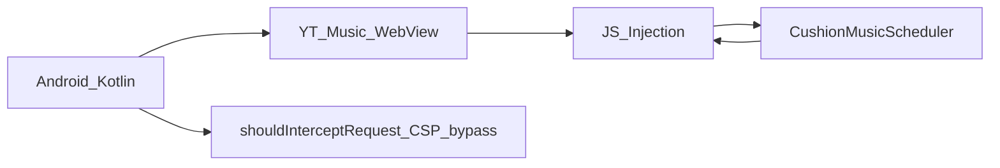
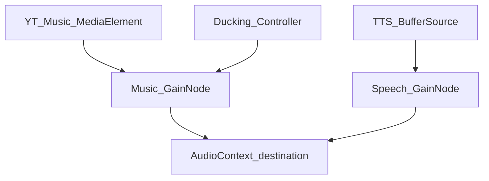

# Architecture

> **Implemented scope:** [project-scope.md](project-scope.md) — personal BYOK Android MVP only.  
> Summary of [research.md](research.md) Sections 3–4. See project-scope on conflict.

## Architecture A — BYOK client

| Layer | Technology |
|-------|------------|
| Platform | Android APK (Phase 1), Desktop later |
| UI language | System locale → `AppLocaleStore` + `values` / `values-en` |
| Music | In-app WebView → YouTube Music PWA |
| Control | JS injection (search/play, now-playing parse) |
| AI | User **Gemini** API key on-device (required; key gate) |
| Audio mix | Web Audio API GainNode ducking |
| Keys | EncryptedSharedPreferences (`SecureKeyStore`, Gemini only) |

No provider server for streaming or AI inference billing.

## WebView control (3.1)



- **SVD:** Selector self-validation on app start; fallback dictionary
- **CSP bypass:** Intercept `music.youtube.com` HTML; inject permissive CSP meta + `NativeAudioBridge`
- **Anti-bot:** Real WebView user session, not headless automation

## Background playback (3.2)

- `PARTIAL_WAKE_LOCK`
- `FOREGROUND_SERVICE_MEDIA_PLAYBACK` + `MediaSessionService`
- Web Worker timer (`HackTimer.js` pattern)

## Audio ducking pipeline (3.3)



Flow: user story → LLM (BYOK) → SSML + fade params → TTS (BYOK) → duck in → play → duck out

## Monorepo layout

```text
harness/tests/       Mock JSON SSOT + Python verification scripts
harness/src/           Python reference algorithms (not shipped)
android/app/src/main/  Production Kotlin + runtime assets (no mock_* names)
android/app/src/test/  JVM unit tests (fixtures synced via sync_fixtures.py)
android/app/src/androidTest/  WebView instrumentation harness
```

Production demo data uses neutral asset names (`catalog/demo_tracks.json`, `admin/default_schedule.json`). See [harness-inventory.md](harness-inventory.md).

```text
docs/research.md     Source of Truth
harness/             Python algorithm verification
android/             Production Kotlin app → APK
```

## Deployment (Android)

- `applicationId`: `com.narrativedj.app`
- `minSdk` 26, `targetSdk` 34
- Debug: `./gradlew assembleDebug`
- Release: local keystore required (not in repo)

## Roadmap

**Active (MVP v0.9.4):** [development-plan.md](development-plan.md) Phase A–F.

| Phase | Focus | Status (v0.9.4) |
|-------|--------|-----------------|
| A | Live YTM + WebView | Fixture green; leave-page auto-confirm; live QA pending |
| B | Cushion | Vector harness parity; **runtime = LLM pool pick + invented bridges** |
| C | DJ ment + ducking | Gemini + Android TTS (rate 0.85) |
| D | Background + MediaSession | FGS + no WebView.onPause; OEM limits documented |
| E | Release ready APK | v0.9.4 — signed APK + checklist pending |
| F | Radio messenger UX | Send + sticky queue + waiting marquee + usable key gate |

**Scaffold complete (research phases 1–3.1):** WebView, SVD, BYOK, profiles, i18n, B2B/Admin shells (frozen, not in menu).

**Deferred (out of MVP scope):** B2B streaming, admin CRUD, GPS guard, OpenAI BYOK, Desktop — see [project-scope.md](project-scope.md).

## Legal / risk (4.1–4.3)

- Client proxy: no server-side music copy
- Commercial space: manual venue toggle + B2B scaffold (**frozen**); GPS deferred per [project-scope.md](project-scope.md)
- YT Music ToS: side-load / personal use MVP; B2B partner APIs in Phase 3
